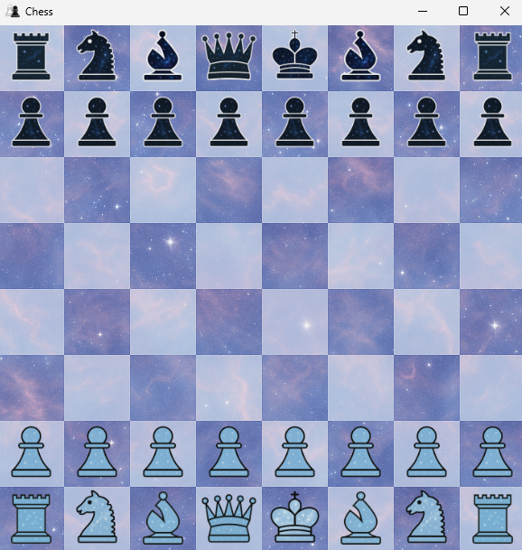
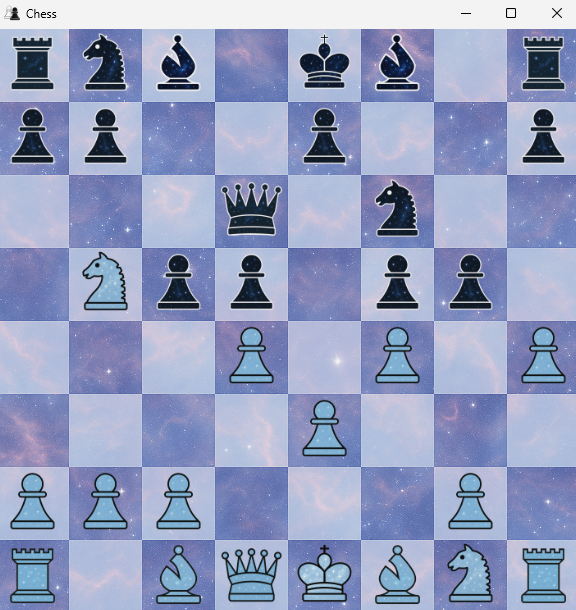
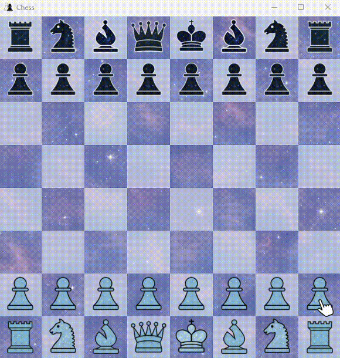
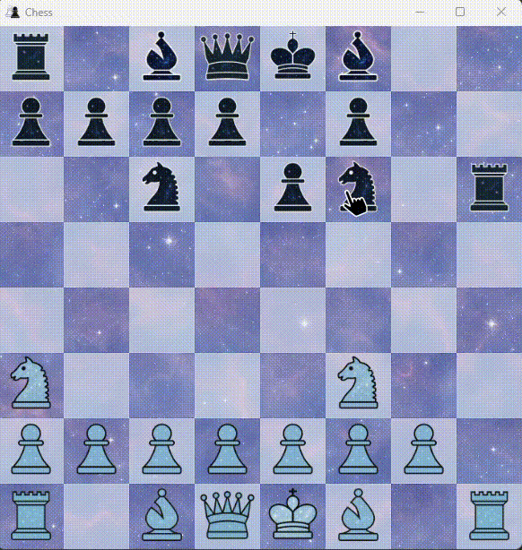
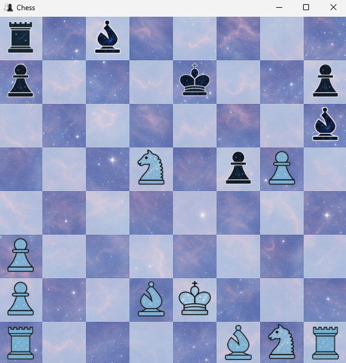
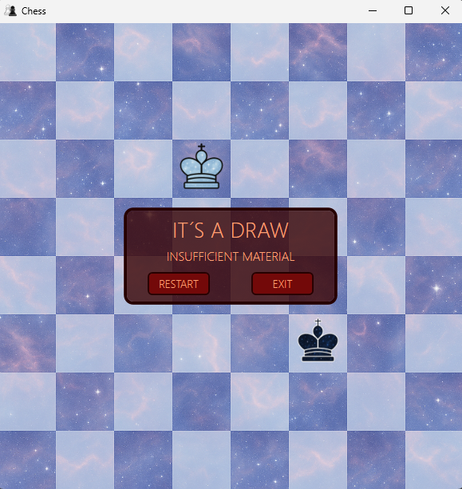

# ♟️ Cosmic Chess

**Cosmic Chess** é um jogo de xadrez com tema espacial, desenvolvido em **C#** com **WPF (Windows Presentation Foundation)**. Ele traz a estratégia clássica do xadrez para um cenário cósmico, onde cada peça representa galáxias do universo. Ideal para quem ama xadrez e também é fã do espaço.

---

## 🌌 Sobre o jogo

O jogo segue as **regras tradicionais do xadrez**, mas apresenta uma ambientação única, com visual e atmosfera inspirados no cosmos. Cada partida é uma batalha intergaláctica entre mentes estratégicas.

---

## 🛠️ Tecnologias utilizadas

- C#
- WPF (.NET)
- XAML para interface gráfica

---

## 🚀 Como jogar

### Pré-requisitos

- .NET Desktop Runtime (versão compatível com seu projeto WPF)
- Windows 10 ou superior

## 📸 Capturas de tela

Veja algumas imagens do jogo em ação:

### Tabuleiro inicial


### Jogabilidade






### Fim de jogo





### Instalação

1. Clone o repositório:
   ```bash
   git clone https://github.com/CarolineGrizante/CosmicChess-csharp.git
